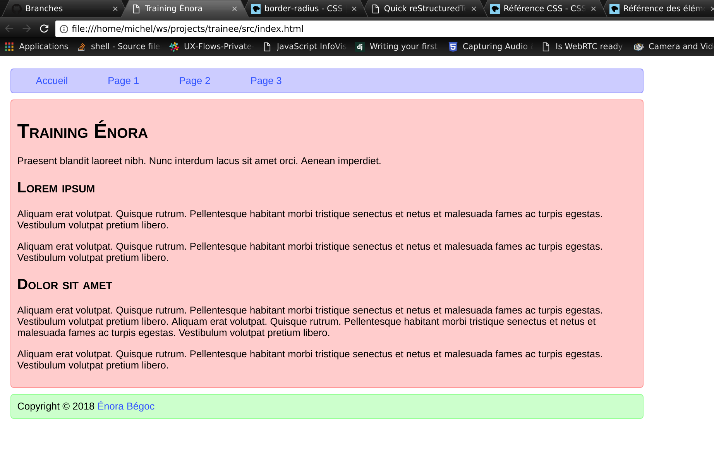

::

    ___________             .__       .__                 ___________
    \__    ___/___________  |__| ____ |__| ____    ____   \_   _____/ ____   ________________
      |    |  \_  __ \__  \ |  |/    \|  |/    \  / ___\   |    __)_ /    \ /  _ \_  __ \__  \
      |    |   |  | \// __ \|  |   |  \  |   |  \/ /_/  >  |        \   |  (  <_> )  | \// __ \_
      |____|   |__|  (____  /__|___|  /__|___|  /\___  /  /_______  /___|  /\____/|__|  (____  /
                          \/        \/        \//_____/           \/     \/                  \/

A training repo for Énora

Environment initial setup
=========================

1. Create an account on github.com and send me your username so I can give
   you the right to write on this repo
2. Install the tools you need on your environment:

   - `Sublime <https://www.sublimetext.com/>`_ for editing the code
   - `git <https://git-scm.com/download/win>`_ for tracking the code modifications and share it with others
   - eventually install `sourcetree <https://www.sourcetreeapp.com/>`_, a visual interface to git
   - you should already have a browser installed on your environment

3. Clone this repository on your devlopment environment with the git clone
   command:

   - create a repository in which you will work
   - run the `git clone https://github.com/mbegoc/training.git` command

Work to do
==========

Working process
---------------

I expect you to work by iterations. At the end of each iteration, we will
have to commit your changes to git and push them to github. The detailed
iteration I expect you pass through are described below.

An iteration is composed of a number of steps:

1. Create a branch in git to work on. The main branch is dev. You should not
   work in this branch. At first you will be on the dev branch. When you
   create a new branch, it contains the same code as de dev one. The command
   to create or view branches is `git branch <branch_name>`
2. Do the work you are supposed to do.
3. Check all is ok and the code is clean, readable and understandable
4. Index the modifications into to git with the command `git add -p`. It will
   ask you to review every change you made before adding it or not
5. Commit the changes with the command `git commit -m <commit message>`. The
   commit message should be descriptive of the content of the work done in the
   commit.
   By commiting code to the new branch, you make `grow` the new branch, so its
   content will become different from the one in the dev branch. It's normal.
   It's also normal at the beginning it's unclear what's going on with git:
   using sourcetree should make it easier to understand. You don't need to
   execute commands on command line: all you need to do can be achieved through
   sourcetree.
6. Push your modification to github.com with the `git push` command
7. Go to github, on the project page, in the branch tab. You should see your
   new branch, with a "new pull request" button. Click on it, fill the form and
   submit the pull request (PR). You should assign me to review it. I will
   review the PR, make suggestions or modifications requests, and you may have
   to commit some modifications. When we are satisfied with the PR, I will
   merge it in github. It will merge your code in the dev branch. When it's
   done, you can pull the dev branch to get your new code in this branch and
   start a new iteration over it.

Iterations
----------

The model you will try to reproduce is as follow |model|

1. I expect you to write raw HTML in the index.html file. The file already
   contains the basic structure of a page. You have to put in the HTML body
   the content of the page. Each section should be in a "div" tag.
   Use "a" tags to make links, "h1" and "h2" to make titles, the "p" tag to wrap
   paragraphs, "ul" tags to make lists.
   You can search for a "lorem ipsum" generator on the internet to get random
   text content.
   The list of HTML tags I used for the model:

   - div
   - span
   - a
   - h1
   - p
   - h2

2. Add style to the page to reproduce the design of the model image. To do so,
   you should work in the static/style.css file. The following properties can
   be useful for doing this:

   - margin
   - padding
   - border
   - border-radius
   - width
   - background-color
   - font-family
   - text-decoration
   - color
   - font-variant-caps

3. Improve the page structure and styles
4. Quickly create the missing pages so the menu lead to somewhere. Copy paste
   the index.html file and modify the content without changing the structure of
   the page, so the CSS styles still work. The link of the page which is active
   should be disabled (remove the link tag). You will have to explicitly add
   each of the new files into git with the `git add <file>` command.
5. Create a test suite so we can be sure everything works before merging PRs.
   More details to come on this.

Resources
=========

`HTML reference <https://developer.mozilla.org/fr/docs/Web/HTML/Element>`_

`CSS reference <https://developer.mozilla.org/fr/docs/Web/CSS/Reference>`_

You can find HTML and CSS tutorials on these sites, but you should know enough
with my introduction, this readme file tips and the starting code I wrote for
you.

Git commands
------------

`Git help <https://git-scm.com/docs>`_
`git clone` copies a repository on a server on your environment
`git pull` get all new modifications from the server and `activate` them
`git add` index modifications in git that will be commited
`git commit` to make some changes permanent
`git push` to send commited modifications to the server

Ask me if you are lost. There is a lot to learn, it's normal if you feel
overwhelmed. Don't give up, take a problem at a time, and it will be ok. I
purposely didn't give you too much detailed explanations so you can explore
a little by yourself and freely work.

